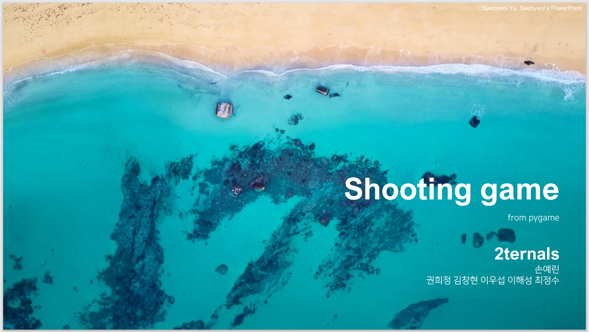

# 2ternals
Group projects from DEC 2021 to MAR 2022

## [Project 1: 해양환경보호를 위한 슈팅게임 Save the Ocean](https://github.com/YerinS/2ternals/blob/main/1_PyGame_Save_the_Ocean/게임_발표자료.pdf)

## [Project 2: 코로나 확산 방지를 위한 마스크 착용여부 판별기](https://github.com/YerinS/2ternals/blob/main/2_Nomask_Detector_for_COVID-19/마스크_발표자료.pdf)

## [Project 3: 우리동네 미세먼지 농도 예측](https://github.com/YerinS/2ternals/blob/main/3_Fine_Dust_Forecast/미세먼지_발표자료.pdf)

## [Project 4: 자율주행을 위한 차선 검출](https://github.com/YerinS/2ternals/blob/main/4_Lane_Detection_for_Autonomous_Vehicles/자율주행_발표자료.pdf)

